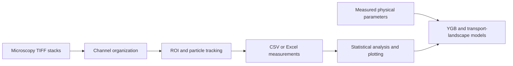

# Marangoni Transport Analysis and Plotting

Analysis, tracking, theoretical modeling, and plotting code associated with the manuscript:

> **Long-range transport of biomolecular condensates by the Marangoni effect**

This repository supports the quantitative analysis of PGL-3–RNA biomolecular condensates in vitro and P granules in *Caenorhabditis elegans* embryos. The central analysis tests whether MEG-3 concentration gradients generate interfacial-tension gradients that drive directed condensate transport through the Marangoni effect.

The code combines microscopy preprocessing, particle/condensate tracking, asymmetry analysis, statistical visualization, and parameter-free theoretical predictions based on the Young–Goldstein–Block (YGB) relation with poro-viscoelastic cytoplasmic drag.

## What this repository contains

- TIFF-stack inspection and ROI-based tracking tools.
- Manual particle tracking and condensate-size analysis.
- TrackMate CSV processing for spots, edges, and tracks.
- Asymmetry, velocity, FMI/CI, MSD, size-distribution, and correlation analyses.
- YGB-based Marangoni velocity calculations and comparisons with motor-driven transport and diffusion.
- Demonstration datasets and example analysis outputs.

## Analysis overview



The repository is organized as a collection of reusable scripts and notebooks rather than a single command-line pipeline. Select the workflow that matches the experiment and update its input paths before running it.

## Repository structure

```text
.
├── data/
│   ├── assymetry_demo/          # TIFF inputs, tracking CSVs, ROI images, and projections
│   ├── pgl_demo/                # Example PGL/MEG channel stacks and metadata
│   ├── embryo_video_demo/       # Example embryo time-lapse data
│   └── trackmate_chart/         # TrackMate spots, edges, and tracks tables
├── src/
│   ├── asymmetry_analysis_series.py
│   ├── manual_tracking_size.py
│   ├── split_channel.py
│   ├── concepts.ipynb
│   ├── plotting.ipynb
│   └── plotting_manual_track.ipynb
├── requirements.txt
├── LICENSE
└── README.md
```

The `data/` directory contains demonstration and processed data intended to document the expected file organization and input formats. Large raw datasets may need to be obtained separately.

## Installation

Use a Python environment with Tk support:

```bash
git clone https://github.com/Guanqi-Pku/marangoni-transport-analysis-plotting.git
cd marangoni-transport-analysis-plotting

python -m venv .venv
```

Activate the environment:

```bash
# Windows PowerShell
.venv\Scripts\Activate.ps1

# macOS or Linux
source .venv/bin/activate
```

Install the scientific Python dependencies:

```bash
python -m pip install --upgrade pip
python -m pip install -r requirements.txt
```

The GUI scripts require `tkinter`. On Windows it is normally included with the standard Python installer. On Linux and macOS, install the platform-specific Tk package if it is not already available.

## Main analysis tools

### 1. Time-series asymmetry tracker

```bash
python src/asymmetry_analysis_series.py
```

`asymmetry_analysis_series.py` launches an interactive Tk/Matplotlib application for multichannel TIFF stacks. It can:

1. Load an RGB or grayscale TIFF stack.
2. Display the magenta and green channels used for asymmetry measurements.
3. Define an ROI manually or detect the largest object automatically.
4. Track the ROI forward through the stack.
5. Estimate the green-channel displacement relative to the magenta condensate using either center-of-mass analysis or cross-correlation.
6. Export per-frame tracking measurements and visualization images.

Typical outputs are:

```text
tracking_results.csv
roi_images/
time_projection_composite.png
```

The exported table includes frame/time information, centroid coordinates, displacement components, displacement magnitude, global and relative angles, and the magenta-channel radius of gyration.

### 2. Manual tracking and size analysis

```bash
python src/manual_tracking_size.py
```

`manual_tracking_size.py` provides an interactive application for single TIFF images or folders of TIFF frames. It supports:

- Manual tracking of multiple particles across frames.
- Global-threshold and Top-Hat detection for uneven backgrounds.
- Minimum and maximum particle-size filtering.
- Gaussian and log-normal distribution fitting.
- Diameter, area, time, and coverage calculations.
- CSV, Excel, PDF, and SVG export.

Typical manual-track columns include:

```text
Track_ID, Frame_Index, Time_s, X_um, Y_um, Diameter_um, Area_um2
```

Batch size-analysis exports additionally include the source filename and coverage ratio.

### 3. Channel organization

```bash
python src/split_channel.py
```

`split_channel.py` organizes image files into channel-specific subfolders using suffix rules such as `ch00.tif`, `ch01.tif`, and `ch02.tif`. Edit `TARGET_DIRECTORY` and `CHANNEL_MAPPING` before use.

This script moves files in place. Back up the input directory before running it, and verify `DEMO_MODE` and the channel mapping first.

## Notebook workflows

### `src/concepts.ipynb`

Theory and model-development notebook. It contains progressively refined calculations for:

- Stokes/Brinkman-type drag in a poro-viscoelastic medium.
- Marangoni-driven condensate velocity.
- Motor-driven velocity and physical constraints.
- Thermal diffusion and displacement comparisons.
- Parameter ranges, sensitivity calculations, phase maps, and transport-landscape plots.

The final cells use SI units and are intended for checking the physical scaling behind the manuscript figures.

### `src/plotting.ipynb`

Main analysis and publication-figure notebook. Depending on the selected cell block, it can process:

- TrackMate spot/edge/track tables.
- Directional asymmetry and relative-angle distributions.
- Forward migration index (FMI) and chemotactic index (CI).
- Rose diagrams and velocity distributions.
- Pairwise Welch tests, ANOVA, effect sizes, violin plots, scatter plots, and box plots.
- Mean-squared displacement and power-law reference slopes.
- Condensate size distributions, raw statistics, and moment-based 3D size estimates.
- YGB theoretical predictions and measured-versus-predicted velocity plots.

The notebook contains several analysis versions developed during figure preparation. Run the relevant code block from top to bottom after updating its input/output configuration.

### `src/plotting_manual_track.ipynb`

Analysis for manually tracked embryo trajectories. It includes:

- Robust time sorting and smoothing.
- Binned velocity statistics.
- Pearson correlation between condensate size/radius and velocity.
- Raw trajectory, binned trend, and uncertainty visualization.
- Optional YGB theoretical curves and parameter bands.

## Input data conventions

The analysis code expects the following broad input types:

| Input | Typical format | Used by |
| --- | --- | --- |
| Multichannel microscopy stacks | `.tif` / `.tiff` | `asymmetry_analysis_series.py`, `split_channel.py` |
| Single-frame or frame-sequence images | `.tif` | `manual_tracking_size.py` |
| TrackMate spot tables | `*_spots.csv` | `plotting.ipynb` |
| TrackMate edge tables | `*_edges.csv` | `plotting.ipynb` |
| TrackMate track tables | `*_tracks.csv` | `plotting.ipynb` |
| Manual tracking tables | `.csv` / `.xlsx` | `plotting_manual_track.ipynb`, plotting cells |
| Microscope metadata | `.xml` and related files | Dataset-specific preprocessing |

TrackMate exports should retain the frame, position, spot/edge identifiers, and track identifiers required to reconstruct displacement and velocity vectors.

## Reproducibility workflow

1. Install the dependencies in a clean environment.
2. Copy or download the required TIFF and CSV inputs.
3. Update the path/configuration cells in the selected notebook or script.
4. Run the relevant tracking/preprocessing step and inspect the exported tables.
5. Run the corresponding plotting and statistical-analysis cells.
6. Run the theoretical cells with the independently measured physical parameters.
7. Save figures, statistical reports, and model-comparison tables to a separate output directory.

Several notebooks and scripts contain paths from the original analysis workstation, for example `D:/Research/...`. These paths are examples only and must be changed for a new environment. Prefer relative paths or a local configuration block when adapting the workflow.

## Important analysis parameters

Check the following values before interpreting results:

- Pixel size and frame interval.
- TIFF channel order and channel-to-color assignment.
- ROI padding and tracking/search settings.
- Detection threshold and minimum/maximum particle size.
- Frame range and velocity-direction reversal settings.
- Unit conversions between pixels, micrometers, seconds, and SI units.
- Group labels and input-file mappings in the plotting notebooks.
- Physical parameters used by the YGB model, including condensate radius, interfacial-tension gradient, internal/external viscosity, and cytoskeletal mesh size.

The theoretical calculations are parameter-free with respect to the measured transport velocity: model parameters should be obtained from measurements or cited literature rather than fitted to the velocity data.

## Relationship to the manuscript

The manuscript uses this code to connect three levels of analysis:

1. **In vitro reconstitution:** MEG-3 gradients, PGL-3–RNA condensate tracking, interfacial properties, and directional migration.
2. **In vivo embryo imaging:** P-granule size, directionality, and anterior-to-posterior transport.
3. **Physical modeling:** YGB Marangoni transport, poro-viscoelastic drag, thermal diffusion, and motor-mediated transport across cargo sizes.

The resulting analysis tests the hypothesis that an endogenous biochemical gradient can be converted into mechanical work at a condensate interface and drive long-range intracellular transport.

## Citation

If you use this repository, please cite the associated manuscript and this code repository:

```bibtex
@misc{guan_marangoni_transport_analysis,
  author       = {Guan, Qi and Ma, Xiaoli and Guan, Xin and Lou, Jizhong and Qi, Zhi},
  title        = {Marangoni Transport Analysis and Plotting Code},
  year         = {2026},
  publisher    = {GitHub},
  howpublished = {\url{https://github.com/Guanqi-Pku/marangoni-transport-analysis-plotting}}
}
```

Use the final published manuscript citation and DOI when they become available.

## License

This repository is distributed under the MIT License. See [LICENSE](LICENSE) for details.

## Contact

For questions about the analysis or manuscript, please open a GitHub issue or contact the corresponding author listed in the manuscript.
